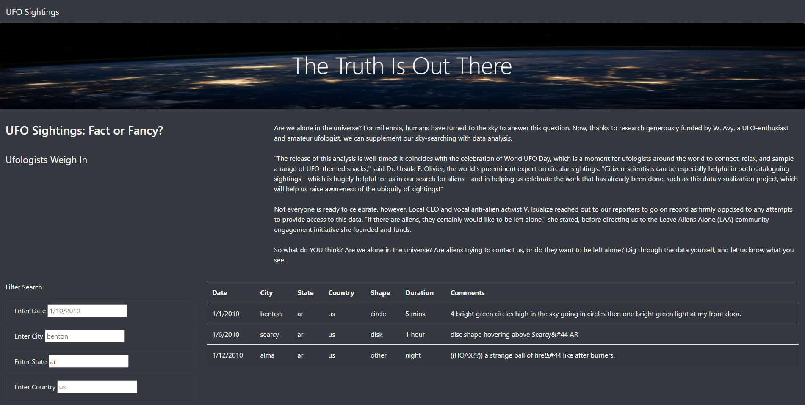
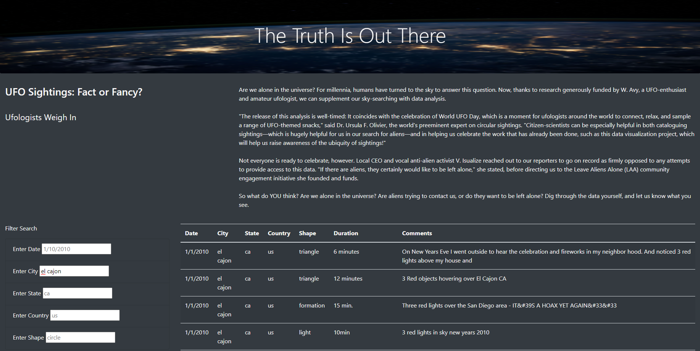

# UFOs

## Overview
### Purpose
The purpose of this project was to take a data file in javascript and create a website that could filter the data for the user.  We wanted the user to be able to see what data they wanted easily by filtering it by the date, city, state, country or shape of the ufo.

## Results
### How to Search
The search tool is very self explanatory and easy to use for the user.  There are input areas for the user to use on the left hand side of the site, and the data is on the right.  If a user wanted to find what UFOs were spotted in Arizona they would go to the state input box and input 'ar'.  This would filter the data and bring up this result.

From the image you can see that there were three results that came up with 'ar'.

## Summary
### Drawback
The main drawback of the website is the lack of searching for multiple filters at once.  I could not figure out how to get the search bars to filter when the user input more than one filter.  The website, right now, can only filter one at a time.

### Recommendations
In order to make this website better, fixing the code to create multiple filter inputs would be a great addition. This way the user could filter by state and date. 
Another recommendation would be to group the data by sightings that are clearly the same. As you can see from this image, the sightings in el cajon seem to be all the same.  It makes it seem as though there were a lot of UFOs but it was just multiple people reporting the same thing.

